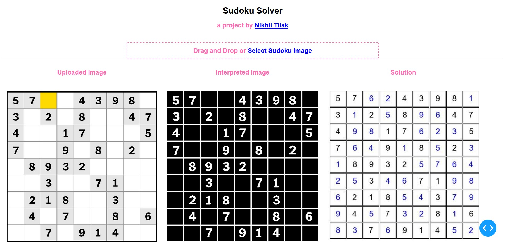
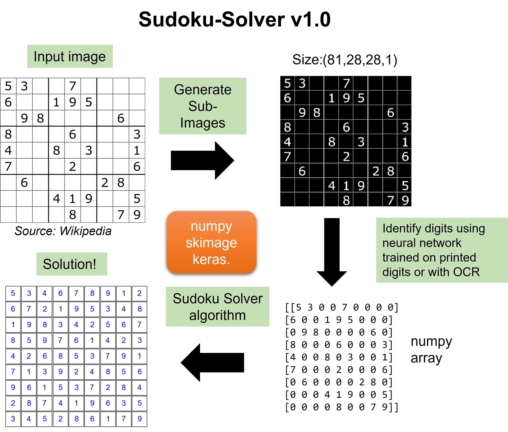

Update December 2022: The [SudokuSolver app](https://sudoku-solver-2ik3k7t6qq-uk.a.run.app) is now live!

Thanks for checking out my Sudoku-Solver.

The aim is to correctly solve a Sudoku puzzle given its image.

The general algorithm of version 1.0 of the project is shown below. 

v1.0 only accepts a high quality digital image of the Sudoku from the top-down perspective.

Currently I am working on version 2 where the image is taken from a any angle using a camera.

The user can then select the corners of the puzzle and a straightened image of the sudoku is generated using a perspective transformation algorithm.

At this stage the neural network model performs worse on data generated using this process. 

Improvements are ongoing. Keep an eye out for version 2.0.

The project is built using numpy, skimage and tensorflow.Keras.

OCR was performed using a free api service.